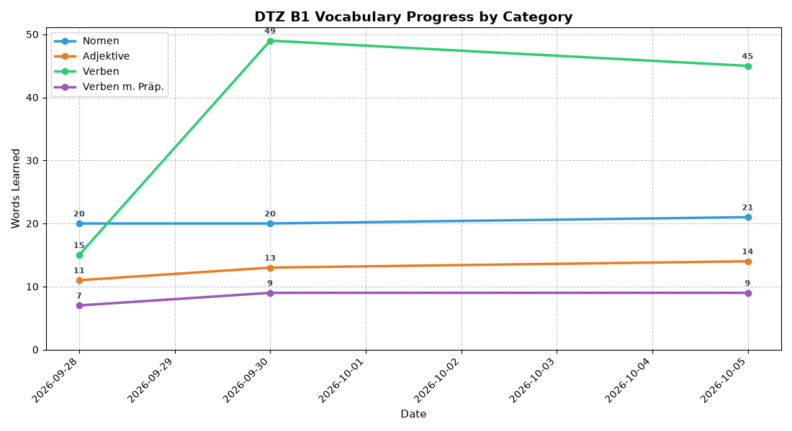

# German Vocabulary Tracker (DTZ B1)


## Live Progress


A personal tool for learning the vocabulary for the DTZ B1 exam: a single-page vocabulary list with
progress tracking, plus a small local automation chain that logs my daily progress and redraws the chart above.

**Honest scope note:** for four counters this is more machinery than needed (a browser export would do).
I built it on purpose as a hands-on project for n8n, Docker, Python data handling and Git automation,
and the trade-offs are documented below.

## Just want to use it?
Open `index.html` in a browser (double-click, no server needed). Tick words as you learn them; progress is
stored in the browser's `localStorage`. Everything below the "Optional automation" heading is optional.

## What it contains

| Part | Technology | Role |
|---|---|---|
| `index.html` | HTML, CSS, vanilla JavaScript | Renders the tables, search, filters, quiz mode (blur/reveal) and progress bar from the data file |
| `vocab.js` | Static data file (`const VOCAB_DATABASE = {...}`) | 395 entries in four categories. A JS file instead of JSON so the page works from `file://` without CORS problems. Every entry has a permanent `id` |
| `validate_vocab.py` | Python | Checks the data file (ids, required fields, duplicates, article/gender match) and assigns ids to new entries |
| n8n (local, Docker) | n8n webhooks + Data Table (SQLite) | Optional: receives the current counts from the browser and stores them in one row |
| `generate_chart.py` | Python (pandas, matplotlib) | Fetches the counts from n8n, appends a row to `progress.csv`, redraws `progress-chart.png` |
| `update.sh`, `bump_version.py` | Bash, Python | Daily script: refresh chart, release a patch version when `vocab.js` changed, push to GitHub |

## How it works

1. **Add words:** add entries to `vocab.js` without an `id`. `update.sh` (or `python3 validate_vocab.py --assign-ids`) gives them the next free id.
2. **Study:** tick words in `index.html`. Progress is saved per entry id, with a timestamp, in `localStorage`.
3. **Sync (optional):** after a tick the page sends the four counts to the n8n webhook, or on demand with the **Sync** button. Nothing is sent on page load, so opening the page in a fresh browser cannot overwrite the stored counts.
4. **Log and chart:** `generate_chart.py` reads the counts via a second webhook, appends them to `progress.csv` and redraws the chart.
5. **Release and push:** `update.sh` validates `vocab.js`, bumps the patch version (`version.txt`, README badge, page header), tags it and pushes. Chart/CSV updates are committed separately.

## Optional automation: setup

```bash
pip install -r requirements.txt
cp config.example.js config.js     # n8n POST webhook URL + token (git-ignored)
cp .env.example .env               # n8n GET webhook URL + token (git-ignored)
python3 validate_vocab.py          # sanity-check the data
./update.sh                        # manual run; logs to logs/update.log
```

Add these lines to `.gitignore`: `config.js`, `.env`, `logs/`, `.venv/`, `__pycache__/`.

- n8n hardening (localhost-only port binding, token auth on the webhooks, payload validation): [`docs/n8n-setup.md`](docs/n8n-setup.md)
- Scheduling on macOS with launchd (runs missed jobs after sleep): [`docs/automation.md`](docs/automation.md)

## Security notes

- n8n must listen on `127.0.0.1` only, and both webhooks require an `X-Api-Key` header. The token and webhook URLs live in git-ignored files, not in this repo.
- Sync is disabled automatically when the page is not served from `file://` or `localhost` (for example on GitHub Pages), so a hosted copy never calls `localhost`.
- The page treats `vocab.js` as trusted: some fields intentionally contain HTML (`<strong>`, `<span>`). Only add content you wrote or checked.
- No third-party scripts, CDNs or analytics are loaded.

## System analysis

### Advantages
* **Data separated from the UI:** the vocabulary lives in `vocab.js`; the page computes totals from the data, not from what is visible, so filters cannot distort the counts.
* **No cloud cost, full ownership:** the history (`progress.csv`), the vocabulary and the browser state are all on my machine.
* **Works offline:** double-click `index.html`; the automation is a bonus, not a dependency.
* **Guard rails:** a validation script stops releases with broken data; the automation script stops at the first error and logs everything.

### Disadvantages & compromises
* **Single-device state:** progress lives in one browser's `localStorage`. A different browser, profile, private window or the GitHub Pages copy has its own separate progress.
* **Moving parts:** Docker, n8n, a scheduler and Git credentials all have to work for the chart to update.
* **Sleeping laptop:** cron skips missed runs; launchd (see docs) catches up after wake.
* **Binary "learned" flag:** there is no spaced repetition; the quiz mode is a blur/reveal helper, not a scheduler.

## Key learnings
* **API payload mapping:** structuring JSON in `fetch()` requests and mapping it to n8n Data Table columns with expressions (`{{ $json.body.nomen }}`).
* **State tied to the DOM breaks:** counting visible rows broke when filters were applied; computing totals from the data fixed it.
* **Keys must be stable ids, not display text:** progress was once keyed by the word's text, so words with several meanings (e.g. *abnehmen*) shared one checkbox, and fixing a typo silently reset progress. Entries now have permanent ids.
* **Never write on load:** the page used to post counts on every load, so one visit from a browser with empty storage overwrote the real counts and put a bogus row in the history. Writes now only happen on a user action.
* **Don't turn missing data into zeros:** a `null` from the API used to be stored as `0`; now the row is skipped and a warning is logged.
* **Automation hygiene:** relative paths, silent failures and `git push --tags` are fragile under a scheduler; the script now changes into its own folder, logs, locks and pushes only the new tag.

## Version history & progression

* **`v2.2.0`** - **Hardening & data integrity:** progress keyed by stable entry ids (with automatic migration of old progress), no sync on page load, token-protected webhooks and payload validation, `validate_vocab.py`, safer `update.sh` / `bump_version.py` / `generate_chart.py`, duplicates removed and synonyms corrected (395 entries).
* **`v2.1.0`** - **Offline-first single page:** moved the data from `vocab.json` to `vocab.js`, which avoids CORS blocks and allows double-click offline use.
* **`v2.0.1`** - **Release automation:** `update.sh` detects vocabulary additions and creates automatic PATCH releases; database grown from ~~285~~ -> 400 B1 words.
* **`v2.0.0`** - **Decoupled architecture (major):** moved from a static HTML monolith to a dynamic page with the data in a separate file, fixing DOM-counting state bugs.
* **`v1.0.1`** - **State patch:** resolved local browser cache mismatches crashing the Python Matplotlib generator.
* **`v1.0.0`** - **Initial launch:** static HTML vocabulary tracker connected to local n8n Docker webhooks with a scheduled Python chart.

## Future roadmap

* **Per-word history:** timestamps are already stored per word; use them for words-per-day and review reminders.
* **Export/import of progress:** a JSON export button to move progress between browsers and devices (the GitHub Pages copy has its own storage).
* **Cloud database (Supabase/Firebase):** replace the local n8n table for cross-device use; requires Row Level Security and no service keys in client code.
* **Power BI dashboard:** worth doing once there is enough history to explore.
* ~~**Automated semantic versioning**~~ *(done in v2.0.1)*
